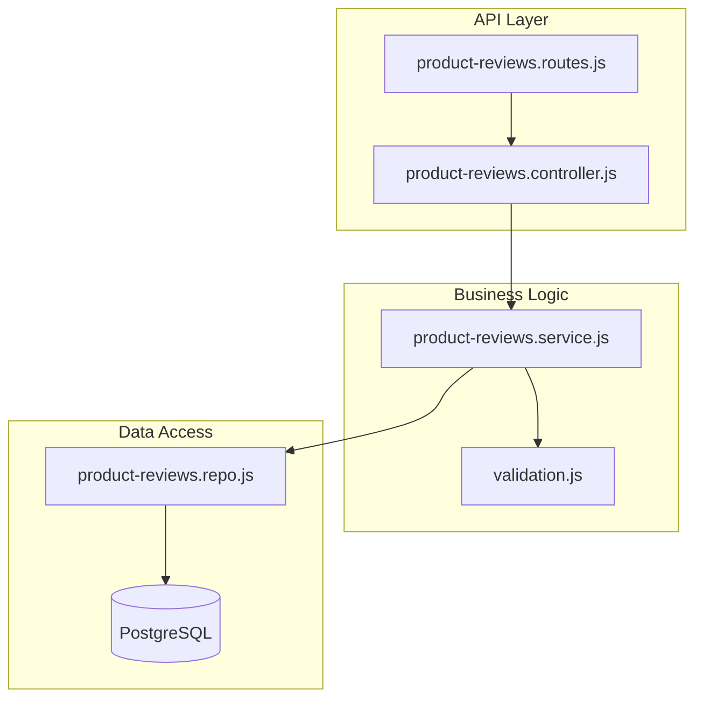

# Design Document: Product Review System

## Overview

The Product Review System is a module that enables users to submit, view, and manage reviews for products. It follows the existing modular architecture pattern used in the codebase (controller → service → repository) and integrates with the PostgreSQL database for persistence.

The system provides:
- CRUD operations for product reviews
- Rating aggregation and summaries per product
- User-specific review management
- Administrative moderation capabilities

## Architecture



### Request Flow

1. HTTP request arrives at Express router
2. Authentication middleware validates JWT token
3. Validation middleware validates request body/params using Zod
4. Controller extracts data and calls service
5. Service applies business logic and calls repository
6. Repository executes SQL queries
7. Response flows back through the layers

## Components and Interfaces

### Routes (product-reviews.routes.js)

| Method | Endpoint | Auth | Description |
|--------|----------|------|-------------|
| POST | `/product-reviews` | User | Create a new review |
| GET | `/product-reviews/product/:productId` | Public | Get reviews for a product |
| GET | `/product-reviews/product/:productId/summary` | Public | Get rating summary |
| GET | `/product-reviews/my-reviews` | User | Get user's own reviews |
| GET | `/product-reviews/:id` | User | Get a specific review |
| PUT | `/product-reviews/:id` | User | Update own review |
| DELETE | `/product-reviews/:id` | User | Delete own review |
| GET | `/product-reviews/admin/all` | Admin | Get all reviews (filtered) |
| DELETE | `/product-reviews/admin/:id` | Admin | Delete any review |

### Controller Interface

```javascript
// Create a new product review
createProductReview(req, res) → { id, product_id, user_id, rating, comment, created_at }

// Get reviews for a product
getProductReviews(req, res) → { reviews: [...], pagination: {...} }

// Get rating summary for a product
getProductRatingSummary(req, res) → { total, average, distribution: {...} }

// Get current user's reviews
getMyProductReviews(req, res) → { reviews: [...], pagination: {...} }

// Get a specific review
getProductReview(req, res) → { id, product_id, user_id, rating, comment, ... }

// Update a review
updateProductReview(req, res) → { id, rating, comment, updated_at }

// Delete a review
deleteProductReview(req, res) → { success: true }

// Admin: Get all reviews
adminGetAllReviews(req, res) → { reviews: [...], pagination: {...} }

// Admin: Delete any review
adminDeleteReview(req, res) → { success: true }
```

### Service Interface

```javascript
// Business logic layer
createReview({ userId, productId, rating, comment }) → Review
getReviewsByProductId(productId, { limit, offset }) → { reviews, total }
getProductRatingSummary(productId) → RatingSummary
getReviewsByUserId(userId, { limit, offset }) → { reviews, total }
getReviewById(reviewId) → Review
updateReview(reviewId, userId, { rating, comment }) → Review
deleteReview(reviewId, userId) → void
adminGetAllReviews({ limit, offset, productId, rating }) → { reviews, total }
adminDeleteReview(reviewId) → void
```

### Repository Interface

```javascript
// Data access layer
createReview({ userId, productId, rating, comment }) → Review
getReviewById(reviewId) → Review | null
getReviewsByProductId(productId, { limit, offset }) → Review[]
getReviewsByUserId(userId, { limit, offset }) → Review[]
updateReview(reviewId, { rating, comment }) → Review
deleteReview(reviewId) → Review
getProductRatingSummary(productId) → RatingSummary
checkExistingReview(userId, productId) → Review | null
countReviewsByProductId(productId) → number
```

## Data Models

### Database Schema

```sql
CREATE TABLE app.product_reviews (
    id SERIAL PRIMARY KEY,
    product_id INTEGER NOT NULL REFERENCES app.products(id) ON DELETE CASCADE,
    user_id INTEGER NOT NULL REFERENCES app.users(id) ON DELETE CASCADE,
    rating INTEGER NOT NULL CHECK (rating >= 1 AND rating <= 5),
    comment TEXT,
    created_at TIMESTAMP WITH TIME ZONE DEFAULT NOW(),
    updated_at TIMESTAMP WITH TIME ZONE DEFAULT NOW(),
    UNIQUE(product_id, user_id)  -- One review per user per product
);

CREATE INDEX idx_product_reviews_product_id ON app.product_reviews(product_id);
CREATE INDEX idx_product_reviews_user_id ON app.product_reviews(user_id);
CREATE INDEX idx_product_reviews_rating ON app.product_reviews(rating);
CREATE INDEX idx_product_reviews_created_at ON app.product_reviews(created_at DESC);
```

### TypeScript-style Interfaces (for documentation)

```typescript
interface ProductReview {
    id: number;
    product_id: number;
    user_id: number;
    rating: number;        // 1-5
    comment: string | null;
    created_at: Date;
    updated_at: Date;
}

interface RatingSummary {
    total_reviews: number;
    average_rating: number;  // Rounded to 2 decimal places
    distribution: {
        one_star: number;
        two_star: number;
        three_star: number;
        four_star: number;
        five_star: number;
    };
}

interface ReviewWithUser extends ProductReview {
    user_handle: string;
    user_display_name: string;
    user_avatar: string | null;
}

interface ReviewWithProduct extends ProductReview {
    product_name: string;
    product_image: string | null;
}
```

### Validation Schemas (Zod)

```javascript
const createProductReviewSchema = z.object({
    product_id: z.number().int().positive(),
    rating: z.number().int().min(1).max(5),
    comment: z.string().max(2000).optional()
});

const updateProductReviewSchema = z.object({
    rating: z.number().int().min(1).max(5).optional(),
    comment: z.string().max(2000).optional()
}).refine(data => data.rating !== undefined || data.comment !== undefined, {
    message: "At least one field (rating or comment) must be provided"
});

const productReviewQuerySchema = z.object({
    limit: z.coerce.number().int().min(1).max(100).default(20),
    offset: z.coerce.number().int().min(0).default(0),
    product_id: z.coerce.number().int().positive().optional(),
    rating: z.coerce.number().int().min(1).max(5).optional()
});
```


## Correctness Properties

*A property is a characteristic or behavior that should hold true across all valid executions of a system-essentially, a formal statement about what the system should do. Properties serve as the bridge between human-readable specifications and machine-verifiable correctness guarantees.*

Based on the acceptance criteria analysis, the following properties must hold:

### Property 1: Create review returns correct data

*For any* valid product ID, rating (1-5), user ID, and optional comment, creating a review SHALL return a review object containing the same product_id, user_id, rating, and comment values that were submitted, along with a valid created_at timestamp.

**Validates: Requirements 1.1, 1.5**

### Property 2: Invalid rating rejection

*For any* integer rating value outside the range [1, 5], attempting to create a review SHALL result in a validation error, and no review record SHALL be created.

**Validates: Requirements 1.2**

### Property 3: Comment sanitization

*For any* comment string, the stored comment SHALL have leading and trailing whitespace removed, and SHALL be truncated to at most 2000 characters.

**Validates: Requirements 1.4**

### Property 4: Reviews sorted by date descending

*For any* product with multiple reviews, retrieving reviews for that product SHALL return them in descending order by created_at timestamp (newest first).

**Validates: Requirements 2.1**

### Property 5: Pagination correctness

*For any* product with N reviews, requesting reviews with limit L and offset O SHALL return exactly min(L, max(0, N-O)) reviews, starting from the (O+1)th review in the sorted order.

**Validates: Requirements 2.4**

### Property 6: Rating summary calculation

*For any* product with reviews, the rating summary SHALL return:
- total_reviews equal to the count of reviews
- average_rating equal to the arithmetic mean of all ratings, rounded to 2 decimal places
- distribution counts that sum to total_reviews

**Validates: Requirements 3.1, 3.3**

### Property 7: Update persists changes

*For any* existing review owned by a user, updating the rating or comment SHALL persist the new values, update the updated_at timestamp to a value greater than the previous updated_at, and return the modified review.

**Validates: Requirements 4.1, 4.4**

### Property 8: Ownership validation

*For any* review, attempting to update or delete that review by a user who is not the owner SHALL result in a forbidden error, and the review SHALL remain unchanged.

**Validates: Requirements 4.2, 5.2**

### Property 9: Delete removes review and updates summary

*For any* existing review, deleting it SHALL:
- Remove the review from the database (subsequent retrieval returns not found)
- Update the product's rating summary to exclude the deleted review's rating

**Validates: Requirements 5.1, 5.4, 7.3**

### Property 10: User reviews filtered correctly

*For any* user with reviews, requesting their reviews SHALL return only reviews where user_id matches the requesting user, and each review SHALL include product information.

**Validates: Requirements 6.1, 6.2**

### Property 11: Admin filtering

*For any* set of reviews, admin queries with product_id filter SHALL return only reviews for that product, and queries with rating filter SHALL return only reviews with that rating.

**Validates: Requirements 7.1**

### Property 12: Date serialization format

*For any* review returned by the API, the created_at and updated_at fields SHALL be formatted as valid ISO 8601 date strings.

**Validates: Requirements 8.3**

## Error Handling

### Error Types and HTTP Status Codes

| Error Type | HTTP Status | Description |
|------------|-------------|-------------|
| ValidationError | 400 | Invalid input (rating out of range, missing required fields) |
| NotFoundError | 404 | Product or review not found |
| ForbiddenError | 403 | User attempting to modify another user's review |
| UnauthorizedError | 401 | Missing or invalid authentication token |
| ConflictError | 409 | User already reviewed this product (if enforcing one review per user per product) |

### Error Response Format

```json
{
    "success": false,
    "message": "Error description",
    "error": {
        "code": "VALIDATION_ERROR",
        "details": [...]
    }
}
```

### Error Handling Strategy

1. **Validation errors**: Caught at middleware level using Zod schemas
2. **Business logic errors**: Thrown in service layer with appropriate status codes
3. **Database errors**: Caught in repository layer, logged, and re-thrown as generic errors
4. **Unexpected errors**: Caught by global error handler, logged with stack trace

## Testing Strategy

### Property-Based Testing

The system will use **fast-check** as the property-based testing library for JavaScript/Node.js.

Each correctness property will be implemented as a property-based test with:
- Minimum 100 iterations per property
- Custom generators for valid review data
- Explicit property annotations referencing the design document

**Test annotation format:**
```javascript
// **Feature: product-reviews, Property 1: Create review returns correct data**
// **Validates: Requirements 1.1, 1.5**
```

**Generator Strategy:**
- Rating generator: `fc.integer({ min: 1, max: 5 })`
- Invalid rating generator: `fc.integer().filter(n => n < 1 || n > 5)`
- Comment generator: `fc.string({ maxLength: 3000 })` (to test truncation)
- Product ID generator: Based on seeded test products

### Unit Testing

Unit tests will cover:
- Individual repository functions with mocked database
- Service layer business logic
- Controller request/response handling
- Validation schema edge cases

### Test File Structure

```
src/modules/product-reviews/
├── __tests__/
│   ├── product-reviews.repo.test.js      # Repository unit tests
│   ├── product-reviews.service.test.js   # Service unit tests
│   ├── product-reviews.controller.test.js # Controller unit tests
│   └── product-reviews.property.test.js  # Property-based tests
```

### Test Database Strategy

- Use a separate test database or transaction rollback for isolation
- Seed test data before property tests
- Clean up after each test suite
